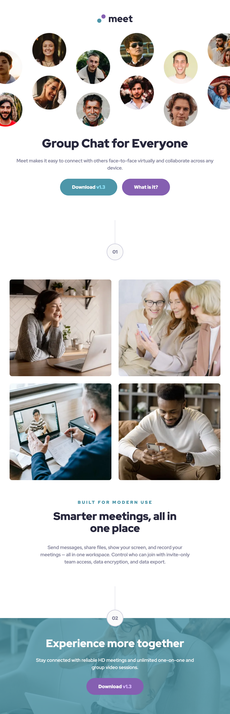
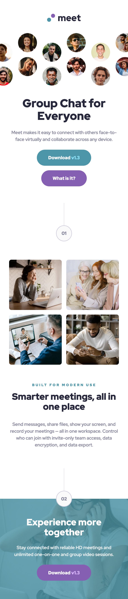

# Frontend Mentor - Meet landing page solution

This is a solution to the [Meet landing page challenge on Frontend Mentor](https://www.frontendmentor.io/challenges/meet-landing-page-rbTDS6OUR). Frontend Mentor challenges help you improve your coding skills by building realistic projects.

## Table of contents

- [Overview](#overview)
  - [The challenge](#the-challenge)
  - [Screenshot](#screenshot)
  - [Links](#links)
- [My process](#my-process)
  - [Built with](#built-with)

## Overview

### The challenge

Users should be able to:

- View the optimal layout depending on their device's screen size
- See hover states for interactive elements
- Appreciate the hard work I put in

### Screenshot

Desktop

Tablet

Mobile

### Links

- [Live Site URL](https://meet-landing-page.frilly.dev/)

## My process

### Built with

- [Svelte](https://svelte.dev/)
- [Astro](https://astro.build/)
- [Tailwind CSS](https://tailwindcss.com/)
